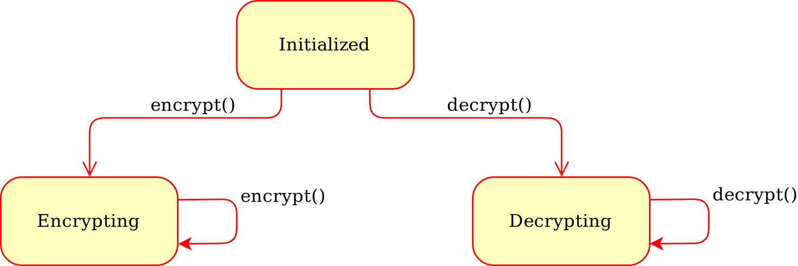

:mod:`Crypto.Cipher` package
============================

Introduction
------------

The :mod:`Crypto.Cipher` package contains algorithms for protecting the confidentiality
of data.

There are three types of encryption algorithms:

1. **Symmetric ciphers**: all parties use the same key, for both
   decrypting and encrypting data.
   Symmetric ciphers are typically very fast and can process
   very large amount of data.

2. **Asymmetric ciphers**: senders and receivers use different keys.
   Senders encrypt with *public* keys (non-secret) whereas receivers
   decrypt with *private* keys (secret).
   Asymmetric ciphers are typically very slow and can process
   only very small payloads. Example: :doc:`oaep`.

3. **Hybrid ciphers**: the two types of ciphers above can be combined
   in a construction that inherits the benefits of both.
   An *asymmetric* cipher is used to protect a short-lived
   symmetric key,
   and a *symmetric* cipher (under that key) encrypts
   the actual message.

API principles
--------------

    Generic state diagram for a cipher object

The base API of a cipher is fairly simple:

*   You instantiate a cipher object by calling the :func:`new`
    function from the relevant cipher module (e.g. :func:`Crypto.Cipher.AES.new`).
    The first parameter is always the *cryptographic key*;
    its length depends on the particular cipher.
    You can (and sometimes must) pass additional cipher- or mode-specific parameters
    to :func:`new` (such as a *nonce* or a *mode of operation*).

*   For encrypting, you call the :func:`encrypt` method of the cipher
    object with the plaintext. The method returns the piece of ciphertext.
    For most algorithms, you may call :func:`encrypt` multiple times
    (i.e. once for each piece of plaintext).

*   For decrypting, you call the :func:`decrypt` method of the cipher
    object with the ciphertext. The method returns the piece of plaintext.
    For most algorithms, you may call :func:`decrypt` multiple times
    (i.e. once for each piece of ciphertext).

.. note::

    Plaintexts and ciphertexts (input/output) are all *byte strings* or *byte arrays*.
    An error will occur with Python 3 strings or Python 2 Unicode strings.

Often, the sender has to deliver to the receiver other data in addition
to ciphertext alone (e.g. **initialization vectors** or **nonces**, **MAC tags**, etc).

This is a basic example::

    >>> from Crypto.Cipher import Salsa20
    >>>
    >>> key = b'0123456789012345'
    >>> cipher = Salsa20.new(key)
    >>> ciphertext =  cipher.encrypt(b'The secret I want to send.')
    >>> ciphertext += cipher.encrypt(b'The second part of the secret.')
    >>> print cipher.nonce  # A byte string you must send to the receiver too

Symmetric ciphers
-----------------

There are two types of symmetric ciphers:

* **Stream ciphers**: the most natural kind of ciphers:
  they encrypt data one byte at a time.
  See :doc:`chacha20` and :doc:`salsa20`.

* **Block ciphers**: ciphers that can only operate on a fixed amount
  of data. The most important block cipher is :doc:`aes`, which has
  a block size of 128 bits (16 bytes).

  In general, a block cipher is mostly useful only together with
  a :doc:`mode of operation <classic>`, which allows one to encrypt
  a variable amount of data. Some modes (like CTR) effectively turn
  a block cipher into a stream cipher.

The widespread consensus is that ciphers that provide
only confidentiality, without any form of authentication, are undesireable.
Instead, primitives have been defined to integrate symmetric encryption and
authentication (MAC). For instance:

* :doc:`Modern modes of operation <modern>` for block ciphers (like GCM).
* Stream ciphers paired with a MAC function, like :doc:`chacha20_poly1305`.

.. toctree::
    :hidden:

    Classic modes of operation <classic>
    Modern modes of operation <modern>

Legacy ciphers
--------------

A number of ciphers are implemented in this library purely for backward compatibility purposes.
They are deprecated or even fully broken and should not be used in new designs.

* :doc:`des` and :doc:`des3` (block ciphers)
* :doc:`arc2` (block cipher)
* :doc:`arc4` (stream cipher)
* :doc:`blowfish` (block cipher)
* :doc:`cast` (block cipher)
* :doc:`pkcs1_v1_5` (asymmetric cipher)
