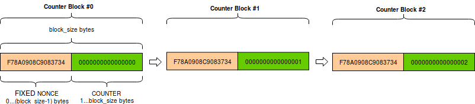

Classic modes of operation for symmetric block ciphers
======================================================

A block cipher uses a symmetric key to encrypt data of fixed and very short length
(the *block size*), such as 16 bytes for AES.
In order to cope with data of arbitrary length, the cipher must be
combined with a *mode of operation*.

You create a cipher object with the :func:`new` function
in the relevant module under ``Crypto.Cipher``:

1. the first parameter is always the cryptographic key (a byte string)
2. the second parameter is always the constant that selects the desired
   mode of operation

Constants for each mode of operation are defined at the module level for each algorithm.
Their name starts with ``MODE_``, for instance :const:`Crypto.Cipher.AES.MODE_CBC`.
Note that not all ciphers support all modes.

For instance::

    >>> from Crypto.Cipher import AES
    >>> from Crypto.Random import get_random_bytes
    >>>
    >>> key = get_random_bytes(16)
    >>> cipher = AES.new(key, AES.MODE_CBC)
    >>>
    >>> # You can now use use cipher to encrypt or decrypt...

The state machine for a cipher configured with a classic mode is:    
    
.. figure:: simple_mode.png
    :align: center
    :figwidth: 50%

    Generic state diagram for a cipher object

What follows is a list of classic modes of operation: they all provide confidentiality
but not data integrity (unlike modern AEAD modes, which are described in :doc:`another section <modern>`).

.. _ecb_mode:

ECB mode
--------
`Electronic CodeBook <https://en.wikipedia.org/wiki/Block_cipher_mode_of_operation#Electronic_Codebook_.28ECB.29>`_.
The most basic but also the weakest mode of operation.
Each block of plaintext is encrypted independently of any other block.

.. warning::
 The ECB mode should not be used because it is `semantically insecure <https://en.wikipedia.org/wiki/Semantic_security>`_.
 For one, it exposes correlation between blocks.

The :func:`new` function at the module level under ``Crypto.Cipher`` instantiates
a new ECB cipher object for the relevant base algorithm.
In the following definition, ``<algorithm>`` could be ``AES``:

.. function:: Crypto.Cipher.<algorithm>.new(key, mode)

  Create a new ECB object, using <algorithm> as the base block cipher.
  
  :param bytes key: the cryptographic key
  :param mode: the constant ``Crypto.Cipher.<algorithm>.MODE_ECB``
  :return: an ECB cipher object

The method :func:`encrypt` (and likewise :func:`decrypt`) of an ECB cipher object
expects data to have length multiple of the block size (e.g. 16 bytes for AES).
You might need to use :mod:`Crypto.Util.Padding` to align the plaintext to the right boundary.

.. _cbc_mode:

CBC mode
--------
`Ciphertext Block Chaining <https://en.wikipedia.org/wiki/Block_cipher_mode_of_operation#Cipher_Block_Chaining_.28CBC.29>`_,
defined in `NIST SP 800-38A, section 6.2 <http://csrc.nist.gov/publications/nistpubs/800-38a/sp800-38a.pdf>`_.
It is a mode of operation where each plaintext block
gets XOR-ed with the previous ciphertext block prior to encryption.

The :func:`new` function at the module level under ``Crypto.Cipher`` instantiates
a new CBC cipher object for the relevant base algorithm.
In the following definition, ``<algorithm>`` could be ``AES``:

.. function:: Crypto.Cipher.<algorithm>.new(key, mode, *, iv=None)

  Create a new CBC object, using <algorithm> as the base block cipher.
  
  :param bytes key: the cryptographic key
  :param mode: the constant ``Crypto.Cipher.<algorithm>.MODE_CBC``
  :param bytes iv: the *Initialization Vector*. A piece of data unpredictable to adversaries.
         It is as long as the block size (e.g. 16 bytes for AES).
         If not present, the library creates a random IV value.
  :return: a CBC cipher object

The method :func:`encrypt` (and likewise :func:`decrypt`) of a CBC cipher object
expects data to have length multiple of the block size (e.g. 16 bytes for AES).
You might need to use :mod:`Crypto.Util.Padding` to align the plaintext to the right boundary.

A CBC cipher object has a read-only attribute :attr:`iv`, holding the
*Initialization Vector* (*bytes*).

Example (encryption)::

    >>> import json
    >>> from base64 import b64encode
    >>> from Crypto.Cipher import AES
    >>> from Crypto.Util.Padding import pad
    >>> from Crypto.Random import get_random_bytes
    >>>
    >>> data = b"secret"
    >>> key = get_random_bytes(16)
    >>> cipher = AES.new(key, AES.MODE_CBC)
    >>> ct_bytes = cipher.encrypt(pad(data, AES.block_size))
    >>> iv = b64encode(cipher.iv).decode('utf-8')
    >>> ct = b64encode(ct_bytes).decode('utf-8')
    >>> result = json.dumps({'iv':iv, 'ciphertext':ct})
    >>> print(result)
    '{"iv": "bWRHdzkzVDFJbWNBY0EwSmQ1UXFuQT09", "ciphertext": "VDdxQVo3TFFCbXIzcGpYa1lJbFFZQT09"}'

Example (decryption)::

    >>> import json
    >>> from base64 import b64decode
    >>> from Crypto.Cipher import AES
    >>> from Crypto.Util.Padding import unpad
    >>>
    >>> # We assume that the key was securely shared beforehand
    >>> try:
    >>>     b64 = json.loads(json_input)
    >>>     iv = b64decode(b64['iv'])
    >>>     ct = b64decode(b64['ciphertext'])
    >>>     cipher = AES.new(key, AES.MODE_CBC, iv)
    >>>     pt = unpad(cipher.decrypt(ct), AES.block_size)
    >>>     print("The message was: ", pt)
    >>> except ValueError, KeyError:
    >>>     print("Incorrect decryption")

.. _ctr_mode:

CTR mode
--------
`CounTeR mode <https://en.wikipedia.org/wiki/Block_cipher_mode_of_operation#Counter_.28CTR.29>`_,
defined in `NIST SP 800-38A, section 6.5 and Appendix B <http://csrc.nist.gov/publications/nistpubs/800-38a/sp800-38a.pdf>`_.
This mode turns the block cipher into a stream cipher.
Each byte of plaintext is XOR-ed with a byte taken from a *keystream*: the result is the ciphertext.
The *keystream* is generated by encrypting a sequence of *counter blocks* with ECB.

A *counter block* is exactly as long as the cipher block size (e.g. 16 bytes for AES).
It consist of the concatenation of two pieces:

1. a fixed **nonce**, set at initialization.
2. a variable **counter**, which gets increased by 1 for any subsequent counter block.
   The counter is big endian encoded.

The :func:`new` function at the module level under ``Crypto.Cipher`` instantiates
a new CTR cipher object for the relevant base algorithm.
In the following definition, ``<algorithm>`` could be ``AES``:

.. function:: Crypto.Cipher.<algorithm>.new(key, mode, *, nonce=None, initial_value=None, counter=None)

  Create a new CTR object, using <algorithm> as the base block cipher.
  
  :param bytes key: the cryptographic key
  :param mode: the constant ``Crypto.Cipher.<algorithm>.MODE_CTR``
  :param bytes nonce: the value of the fixed nonce.
    It must be unique for the combination message/key.
    Its length varies from 0 to the block size minus 1.
    If not present, the library creates a random nonce of length equal to block size/2.
  :param initial_value: the value of the counter for the first counter block.
    It can be either an integer or *bytes* (which is the same integer, just big endian encoded).
    If not specified, the counter starts at 0.
  :type initial_value: integer or bytes
  :param counter: a custom counter object created with :func:`Crypto.Util.Counter.new`.
    This allows the definition of a more complex counter block.
  :return: a CTR cipher object

The methods :func:`encrypt` and :func:`decrypt` of a CTR cipher object
accept data of any length (i.e. padding is not needed).
Both raise an ``OverflowError`` exception as soon as the counter wraps around to repeat the original value.

The CTR cipher object has a read-only attribute :attr:`nonce` (*bytes*).

Example (encryption)::

    >>> import json
    >>> from base64 import b64encode
    >>> from Crypto.Cipher import AES
    >>> from Crypto.Random import get_random_bytes
    >>>
    >>> data = b"secret"
    >>> key = get_random_bytes(16)
    >>> cipher = AES.new(key, AES.MODE_CTR)
    >>> ct_bytes = cipher.encrypt(data)
    >>> nonce = b64encode(cipher.nonce).decode('utf-8')
    >>> ct = b64encode(ct_bytes).decode('utf-8')
    >>> result = json.dumps({'nonce':nonce, 'ciphertext':ct})
    >>> print(result)
    {"nonce": "XqP8WbylRt0=", "ciphertext": "Mie5lqje"}

Example (decryption)::

    >>> import json
    >>> from base64 import b64decode
    >>> from Crypto.Cipher import AES
    >>>
    >>> # We assume that the key was securely shared beforehand
    >>> try:
    >>>     b64 = json.loads(json_input)
    >>>     nonce = b64decode(b64['nonce'])
    >>>     ct = b64decode(b64['ciphertext'])
    >>>     cipher = AES.new(key, AES.MODE_CTR, nonce=nonce)
    >>>     pt = cipher.decrypt(ct)
    >>>     print("The message was: ", pt)
    >>> except ValueError, KeyError:
    >>>     print("Incorrect decryption")

.. _cfb_mode:

CFB mode
--------
`Cipher FeedBack <https://en.wikipedia.org/wiki/Block_cipher_mode_of_operation#Electronic_Codebook_.28ECB.29>`_,
defined in `NIST SP 800-38A, section 6.3 <http://csrc.nist.gov/publications/nistpubs/800-38a/sp800-38a.pdf>`_.
It is a mode of operation which turns the block cipher into a stream cipher.
Each byte of plaintext is XOR-ed with a byte taken from a *keystream*: the result is the ciphertext.

The *keystream* is obtained on a per-segment basis: the plaintext is broken up in
segments (from 1 byte up to the size of a block). Then, for each segment,
the keystream is obtained by encrypting with the block cipher the last piece of
ciphertext produced so far - possibly backfilled with the *Initialization Vector*,
if not enough ciphertext is available yet.

The :func:`new` function at the module level under ``Crypto.Cipher`` instantiates
a new CFB cipher object for the relevant base algorithm.
In the following definition, ``<algorithm>`` could be ``AES``:

.. function:: Crypto.Cipher.<algorithm>.new(key, mode, *, iv=None, segment_size=8)

  Create a new CFB object, using <algorithm> as the base block cipher.
  
  :param bytes key: the cryptographic key
  :param mode: the constant ``Crypto.Cipher.<algorithm>.MODE_CFB``
  :param bytes iv: the *Initialization Vector*.
         It must be unique for the combination message/key.
         It is as long as the block size (e.g. 16 bytes for AES).
         If not present, the library creates a random IV.
  :param integer segment_size: the number of **bits** (not bytes!) the plaintext and the
    ciphertext are segmented in (default if not specified: 8 bits = 1 byte).
  :return: a CFB cipher object

The methods :func:`encrypt` and :func:`decrypt` of a CFB cipher object
accept data of any length (i.e. padding is not needed).

The CFB cipher object has a read-only attribute :attr:`iv` (*bytes*), holding
the Initialization Vector.

Example (encryption)::

    >>> import json
    >>> from base64 import b64encode
    >>> from Crypto.Cipher import AES
    >>> from Crypto.Random import get_random_bytes
    >>>
    >>> data = b"secret"
    >>> key = get_random_bytes(16)
    >>> cipher = AES.new(key, AES.MODE_CFB)
    >>> ct_bytes = cipher.encrypt(data)
    >>> iv = b64encode(cipher.iv).decode('utf-8')
    >>> ct = b64encode(ct_bytes).decode('utf-8')
    >>> result = json.dumps({'iv':iv, 'ciphertext':ct})
    >>> print(result)
    {"iv": "VoamO23kFSOZcK1O2WiCDQ==", "ciphertext": "f8jciJ8/"}

Example (decryption)::

    >>> import json
    >>> from base64 import b64decode
    >>> from Crypto.Cipher import AES
    >>>
    >>> # We assume that the key was securely shared beforehand
    >>> try:
    >>>     b64 = json.loads(json_input)
    >>>     nonce = b64decode(b64['nonce'])
    >>>     ct = b64decode(b64['ciphertext'])
    >>>     cipher = AES.new(key, AES.MODE_CFB, iv=iv)
    >>>     pt = cipher.decrypt(ct)
    >>>     print("The message was: ", pt)
    >>> except ValueError, KeyError:
    >>>     print("Incorrect decryption")

.. _ofb_mode:

OFB mode
--------
`Output FeedBack <https://en.wikipedia.org/wiki/Block_cipher_mode_of_operation#Output_Feedback_.28OFB.29>`_,
defined in `NIST SP 800-38A, section 6.4 <http://csrc.nist.gov/publications/nistpubs/800-38a/sp800-38a.pdf>`_.
It is another mode that leads to a stream cipher.
Each byte of plaintext is XOR-ed with a byte taken from a *keystream*: the result is the ciphertext.
The *keystream* is obtained by recursively encrypting the *Initialization Vector*.

The :func:`new` function at the module level under ``Crypto.Cipher`` instantiates
a new OFB cipher object for the relevant base algorithm.
In the following definition, ``<algorithm>`` could be ``AES``:

.. function:: Crypto.Cipher.<algorithm>.new(key, mode, *, iv=None)

  Create a new OFB object, using <algorithm> as the base block cipher.
  
  :param bytes key: the cryptographic key
  :param mode: the constant ``Crypto.Cipher.<algorithm>.MODE_OFB``
  :param bytes iv: the *Initialization Vector*.
         It must be unique for the combination message/key.
         It is as long as the block size (e.g. 16 bytes for AES).
         If not present, the library creates a random IV.
  :return: an OFB cipher object

The methods :func:`encrypt` and :func:`decrypt` of an OFB cipher object
accept data of any length (i.e. padding is not needed).

The OFB cipher object has a read-only attribute :attr:`iv` (*bytes*), holding
the Initialization Vector.

Example (encryption)::

    >>> import json
    >>> from base64 import b64encode
    >>> from Crypto.Cipher import AES
    >>> from Crypto.Random import get_random_bytes
    >>>
    >>> data = b"secret"
    >>> key = get_random_bytes(16)
    >>> cipher = AES.new(key, AES.MODE_OFB)
    >>> ct_bytes = cipher.encrypt(data)
    >>> iv = b64encode(cipher.iv).decode('utf-8')
    >>> ct = b64encode(ct_bytes).decode('utf-8')
    >>> result = json.dumps({'iv':iv, 'ciphertext':ct})
    >>> print(result)
    {"iv": "NUuRJbL0UMp8+UMCk2/vQA==", "ciphertext": "XGVGc1Gw"}

Example (decryption)::

    >>> import json
    >>> from base64 import b64decode
    >>> from Crypto.Cipher import AES
    >>>
    >>> # We assume that the key was securely shared beforehand
    >>> try:
    >>>     b64 = json.loads(json_input)
    >>>     nonce = b64decode(b64['nonce'])
    >>>     ct = b64decode(b64['ciphertext'])
    >>>     cipher = AES.new(key, AES.MODE_OFB, iv=iv)
    >>>     pt = cipher.decrypt(ct)
    >>>     print("The message was: ", pt)
    >>> except ValueError, KeyError:
    >>>     print("Incorrect decryption")

.. _openpgp_mode:

OpenPGP mode
------------
Constant: ``Crypto.Cipher.<cipher>.MODE_OPENPGP``.

OpenPGP (defined in `RFC4880 <https://tools.ietf.org/html/rfc4880>`_).
A variant of CFB, with two differences:

1.  The first invokation to the :func:`encrypt` method
    returns the encrypted IV concatenated to the first chunk
    on ciphertext (as opposed to the ciphertext only).
    The encrypted IV is as long as the block size plus 2 more bytes.

2.  When the cipher object is intended for decryption,
    the parameter ``iv`` to :func:`new` is the encrypted IV
    (and not the IV, which is still the case for encryption).

Like for CTR, an OpenPGP cipher object has a read-only attribute :attr:`iv`.

