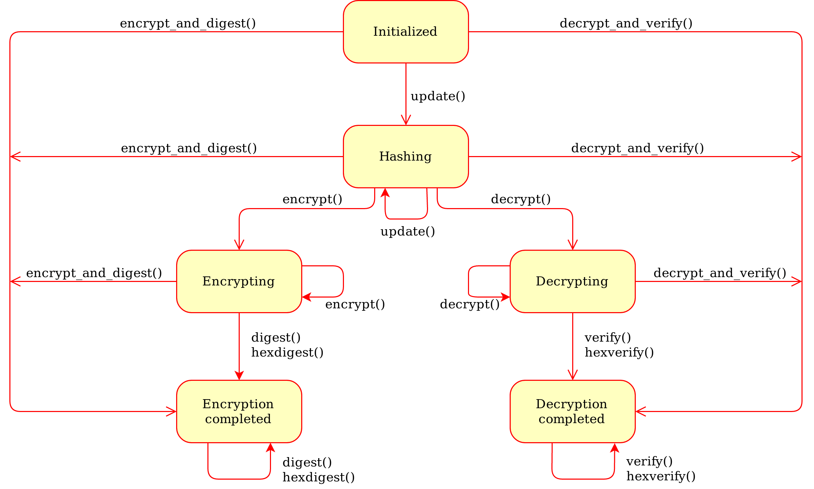
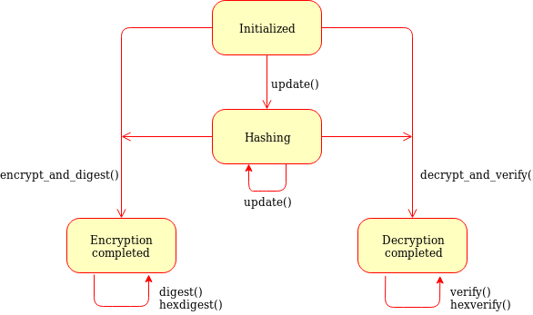

Modern modes of operation for symmetric block ciphers
=====================================================

Classic modes of operation such as CBC only provide guarantees over
the *confidentiality* of the message but not over its *integrity*.
In other words, they don't allow the receiver to establish if the 
ciphertext was modified in transit or if it really originates
from a certain source.

For that reason, classic modes of operation have been often paired with
a MAC primitive (such as :mod:`Crypto.Hash.HMAC`), but the
combination is not always straightforward, efficient or secure.

Recently, new modes of operations (AEAD, for `Authenticated Encryption
with Associated Data <https://en.wikipedia.org/wiki/Authenticated_encryption>`_)
have been designed to combine *encryption* and *authentication* into a single,
efficient primitive. Optionally, some part of the message can also be left in the
clear (non-confidential *associated data*, such as headers),
while the whole message remains fully authenticated.

In addition to the **ciphertext** and a **nonce** (or **IV** - Initialization
Vector), AEAD modes require the additional delivery of a **MAC tag**.

This is the state machine for a cipher object:

    
    Generic state diagram for a AEAD cipher mode

Beside the usual :meth:`encrypt()` and :meth:`decrypt()` already
available for classic modes of operation, several other methods are present:

.. method:: update(data)

    Authenticate those parts of the message that get delivered as is,
    without any encryption (like headers).
    It is similar to the ``update()`` method of a MAC object.
    Note that all data passed to ``encrypt()`` and ``decrypt()`` get
    automatically authenticated already.

    :param bytes data: the extra data to authenticate

.. method:: digest()

    Create the final authentication tag (MAC tag) for a message.

    :return bytes: the MAC tag
 
.. method:: hexdigest()

    Equivalent to ``digest()``, with the output encoded in hexadecimal.

    :return str: the MAC tag as a hexadecimal string

.. method:: verify(mac_tag)

    Check if the provided authentication tag (MAC tag) is valid, that is, if the message
    has been decrypted using the right key and if no modification has taken
    place in transit.

    :param bytes mac_tag: the MAC tag
    :raise ValueError: if the MAC tag is not valid, that is, if the entire message
                       should not be trusted.
 
.. method:: verify(mac_tag_hex)

    Same as ``verify()`` but accepts the MAC tag encoded as an hexadecimal
    string.

    :param str mac_tag_hex: the MAC tag as a hexadecimal string
    :raise ValueError: if the MAC tag is not valid, that is, if the entire message
                       should not be trusted.

.. method:: encrypt_and_digest(plaintext)

    Perform ``encrypt()`` and ``digest()`` in one go.

    :param bytes plaintext: the last piece of plaintext to encrypt
    :return bytes: the MAC tag

.. method:: decrypt_and_verify(ciphertext, mac_tag)

    Perform ``decrypt()`` and ``verify()`` in one go.
    
    :param bytes ciphertext: the last piece of ciphertext to decrypt
    :raise ValueError: if the MAC tag is not valid, that is, if the entire message
                       should not be trusted.

.. _ccm_mode:

CCM mode
--------
`Counter with CBC-MAC <https://en.wikipedia.org/wiki/CCM_mode>`_, defined in
`RFC3610 <https://tools.ietf.org/html/rfc3610>`_ or
`NIST SP 800-38C <http://csrc.nist.gov/publications/nistpubs/800-38C/SP800-38C.pdf>`_.
It only works with ciphers having block size 128 bits (like AES).
 
The :func:`new` function at the module level under ``Crypto.Cipher`` instantiates
a new CCM cipher object for the relevant base algorithm.
In the following definition, ``<algorithm>`` can only be ``AES`` today:

.. function:: Crypto.Cipher.<algorithm>.new(key, mode, *, nonce=None, mac_len=None, msg_len=None, assoc_len=None)

  Create a new CCM object, using <algorithm> as the base block cipher.
  
  :param bytes key: the cryptographic key
  :param mode: the constant ``Crypto.Cipher.<algorithm>.MODE_CCM``
  :param bytes nonce: the value of the fixed nonce.
    It must be unique for the combination message/key.
    For AES, its length varies from 7 to 13 bytes.
    The longer the nonce, the smaller the allowed message size
    (with a nonce of 13 bytes, the message cannot exceed 64KB).
    If not present, the library creates a 11 bytes random nonce (the maximum
    message size is 8GB).
  :param integer mac_len: the desired length of the 
    MAC tag (default if not present: 16 bytes).
  :param integer msg_len: pre-declaration of the length of the
    message to encipher. If not specified, :func:`encrypt` and :func:`decrypt`
    can only be called once.
  :param integer assoc_len: pre-declaration of the length of the
    associated data. If not specified, some extra buffering will take place
    internally.
  :return: a CTR cipher object
      
The cipher object has a read-only attribute :attr:`nonce`.

Example (encryption)::

    >>> import json
    >>> from base64 import b64encode
    >>> from Crypto.Cipher import AES
    >>> from Crypto.Random import get_random_bytes
    >>>
    >>> header = b"header"
    >>> data = b"secret"
    >>> key = get_random_bytes(16)
    >>> cipher = AES.new(key, AES.MODE_CCM)
    >>> cipher.update(header)
    >>> ciphertext, tag = cipher.encrypt_and_digest(data)
    >>>
    >>> json_k = [ 'nonce', 'header', 'ciphertext', 'tag' ]
    >>> json_v = [ b64encode(x).decode('utf-8') for x in cipher.nonce, header, ciphertext, tag ] 
    >>> result = json.dumps(dict(zip(json_k, json_v)))
    >>> print(result)
    {"nonce": "p6ffzcKw+6xopVQ=", "header": "aGVhZGVy", "ciphertext": "860kZo/G", "tag": "Ck5YpVCM6fdWnFkFxw8K6A=="}

Example (decryption)::

    >>> import json
    >>> from base64 import b64decode
    >>> from Crypto.Cipher import AES
    >>>
    >>> # We assume that the key was securely shared beforehand
    >>> try:
    >>>     b64 = json.loads(json_input)
    >>>     json_k = [ 'nonce', 'header', 'ciphertext', 'tag' ]
    >>>     jv = {k:b64decode(b64[k]) for k in json_k}    
    >>>     
    >>>     cipher = AES.new(key, AES.MODE_CCM, nonce=jv['nonce'])
    >>>     cipher.update(jv['header'])
    >>>     plaintext = cipher.decrypt_and_verify(jv['ciphertext'], jv['tag'])
    >>>     print("The message was: " + plaintext)
    >>> except ValueError, KeyError:
    >>>     print("Incorrect decryption")

.. _eax_mode:

EAX mode
--------
An AEAD mode designed for NIST by
`Bellare, Rogaway, and Wagner in 2003 <http://csrc.nist.gov/groups/ST/toolkit/BCM/documents/proposedmodes/eax/eax-spec.pdf>`_.

The :func:`new` function at the module level under ``Crypto.Cipher`` instantiates
a new EAX cipher object for the relevant base algorithm.

.. function:: Crypto.Cipher.<algorithm>.new(key, mode, *, nonce=None, mac_len=None)

  Create a new EAX object, using <algorithm> as the base block cipher.
  
  :param bytes key: the cryptographic key
  :param mode: the constant ``Crypto.Cipher.<algorithm>.MODE_EAX``
  :param bytes nonce: the value of the fixed nonce.
    It must be unique for the combination message/key.
    If not present, the library creates a random nonce (16 bytes long for AES).
  :param integer mac_len: the desired length of the 
    MAC tag (default if not present: the cipher's block size, 16 bytes for AES).
  :return: an EAX cipher object
      
The cipher object has a read-only attribute :attr:`nonce`.

Example (encryption)::

    >>> import json
    >>> from base64 import b64encode
    >>> from Crypto.Cipher import AES
    >>> from Crypto.Random import get_random_bytes
    >>>
    >>> header = b"header"
    >>> data = b"secret"
    >>> key = get_random_bytes(16)
    >>> cipher = AES.new(key, AES.MODE_EAX)
    >>> cipher.update(header)
    >>> ciphertext, tag = cipher.encrypt_and_digest(data)
    >>>
    >>> json_k = [ 'nonce', 'header', 'ciphertext', 'tag' ]
    >>> json_v = [ b64encode(x).decode('utf-8') for x in cipher.nonce, header, ciphertext, tag ] 
    >>> result = json.dumps(dict(zip(json_k, json_v)))
    >>> print(result)
    {"nonce": "CSIJ+e8KP7HJo+hC4RXIyQ==", "header": "aGVhZGVy", "ciphertext": "9YYjuAn6", "tag": "kXHrs9ZwYmjDkmfEJx7Clg=="}

Example (decryption)::

    >>> import json
    >>> from base64 import b64decode
    >>> from Crypto.Cipher import AES
    >>>
    >>> # We assume that the key was securely shared beforehand
    >>> try:
    >>>     b64 = json.loads(json_input)
    >>>     json_k = [ 'nonce', 'header', 'ciphertext', 'tag' ]
    >>>     jv = {k:b64decode(b64[k]) for k in json_k}    
    >>>     
    >>>     cipher = AES.new(key, AES.MODE_EAX, nonce=jv['nonce'])
    >>>     cipher.update(jv['header'])
    >>>     plaintext = cipher.decrypt_and_verify(jv['ciphertext'], jv['tag'])
    >>>     print("The message was: " + plaintext)
    >>> except ValueError, KeyError:
    >>>     print("Incorrect decryption")

.. _gcm_mode:

GCM mode
--------
`Galois/Counter Mode <https://en.wikipedia.org/wiki/Galois/Counter_Mode>`_,
defined in `NIST SP 800-38D <http://csrc.nist.gov/publications/nistpubs/800-38D/SP-800-38D.pdf>`_.
It only works in combination with a 128 bits cipher like AES.

The :func:`new` function at the module level under ``Crypto.Cipher`` instantiates
a new GCM cipher object for the relevant base algorithm.

.. function:: Crypto.Cipher.<algorithm>.new(key, mode, *, nonce=None, mac_len=None)

  Create a new GCM object, using <algorithm> as the base block cipher.
  
  :param bytes key: the cryptographic key
  :param mode: the constant ``Crypto.Cipher.<algorithm>.MODE_GCM``
  :param bytes nonce: the value of the fixed nonce.
    It must be unique for the combination message/key.
    If not present, the library creates a random nonce (16 bytes long for AES).
  :param integer mac_len: the desired length of the 
    MAC tag (default if not present: the cipher's block size, 16 bytes for AES).
  :return: a GCM cipher object
      
The cipher object has a read-only attribute :attr:`nonce`.

Example (encryption)::

    >>> import json
    >>> from base64 import b64encode
    >>> from Crypto.Cipher import AES
    >>> from Crypto.Random import get_random_bytes
    >>>
    >>> header = b"header"
    >>> data = b"secret"
    >>> key = get_random_bytes(16)
    >>> cipher = AES.new(key, AES.MODE_GCM)
    >>> cipher.update(header)
    >>> ciphertext, tag = cipher.encrypt_and_digest(data)
    >>>
    >>> json_k = [ 'nonce', 'header', 'ciphertext', 'tag' ]
    >>> json_v = [ b64encode(x).decode('utf-8') for x in cipher.nonce, header, ciphertext, tag ] 
    >>> result = json.dumps(dict(zip(json_k, json_v)))
    >>> print(result)
    {"nonce": "DpOK8NIOuSOQlTq+BphKWw==", "header": "aGVhZGVy", "ciphertext": "CZVqyacc", "tag": "B2tBgICbyw+Wji9KpLVa8w=="}

Example (decryption)::

    >>> import json
    >>> from base64 import b64decode
    >>> from Crypto.Cipher import AES
    >>> from Crypto.Util.Padding import unpad
    >>>
    >>> # We assume that the key was securely shared beforehand
    >>> try:
    >>>     b64 = json.loads(json_input)
    >>>     json_k = [ 'nonce', 'header', 'ciphertext', 'tag' ]
    >>>     jv = {k:b64decode(b64[k]) for k in json_k}    
    >>>     
    >>>     cipher = AES.new(key, AES.MODE_GCM, nonce=jv['nonce'])
    >>>     cipher.update(jv['header'])
    >>>     plaintext = cipher.decrypt_and_verify(jv['ciphertext'], jv['tag'])
    >>>     print("The message was: " + plaintext)
    >>> except ValueError, KeyError:
    >>>     print("Incorrect decryption")

.. _siv_mode:

SIV mode
--------
Synthetic Initialization Vector (SIV), defined in `RFC5297 <https://tools.ietf.org/html/rfc5297>`_.
It only works with ciphers with a block size of 128 bits (like AES).

Although less efficient than other modes, SIV is *nonce misuse-resistant*:
accidental reuse of the nonce does not jeopardize the security as it happens with CCM or GCM.
As a matter of fact, operating **without** a nonce is not an error per se: the cipher
simply becomes **deterministic**. In other words, a message gets always encrypted into
the same ciphertext.

The :func:`new` function at the module level under ``Crypto.Cipher`` instantiates
a new SIV cipher object for the relevant base algorithm.

.. function:: Crypto.Cipher.<algorithm>.new(key, mode, *, nonce=None)

  Create a new SIV object, using <algorithm> as the base block cipher.
  
  :param bytes key: the cryptographic key; it must be twice the size of the key 
                    required by the underlying cipher (e.g. 32 bytes for
                    AES-128).
  :param mode: the constant ``Crypto.Cipher.<algorithm>.MODE_SIV``
  :param bytes nonce: the value of the fixed nonce.
    It must be unique for the combination message/key.
    If not present, the encryption will be deterministic.
  :return: a SIV cipher object

If the `nonce` parameter was provided to :func:`new`, the resulting cipher object has a read-only attribute :attr:`nonce`.

Example (encryption)::

    >>> import json
    >>> from base64 import b64encode
    >>> from Crypto.Cipher import AES
    >>> from Crypto.Random import get_random_bytes
    >>>
    >>> header = b"header"
    >>> data = b"secret"
    >>> key = get_random_bytes(16 * 2)
    >>> nonce = get_random_bytes(16)
    >>> cipher = AES.new(key, AES.MODE_SIV, nonce=nonce)    # Without nonce, the encryption
    >>>                                                     # becomes deterministic
    >>> cipher.update(header)
    >>> ciphertext, tag = cipher.encrypt_and_digest(data)
    >>>
    >>> json_k = [ 'nonce', 'header', 'ciphertext', 'tag' ]
    >>> json_v = [ b64encode(x).decode('utf-8') for x in nonce, header, ciphertext, tag ] 
    >>> result = json.dumps(dict(zip(json_k, json_v)))
    >>> print(result)
    {"nonce": "zMiifAVvDpMS8hnGK/z+iw==", "header": "aGVhZGVy", "ciphertext": "Q7lReEAF", "tag": "KgdnBVbCee6B/wGmMf/wQA=="}

Example (decryption)::

    >>> import json
    >>> from base64 import b64decode
    >>> from Crypto.Cipher import AES
    >>>
    >>> # We assume that the key was securely shared beforehand
    >>> try:
    >>>     b64 = json.loads(json_input)
    >>>     json_k = [ 'nonce', 'header', 'ciphertext', 'tag' ]
    >>>     jv = {k:b64decode(b64[k]) for k in json_k}    
    >>>     
    >>>     cipher = AES.new(key, AES.MODE_SIV, nonce=jv['nonce'])
    >>>     cipher.update(jv['header'])
    >>>     plaintext = cipher.decrypt_and_verify(jv['ciphertext'], jv['tag'])
    >>>     print("The message was: " + plaintext)
    >>> except ValueError, KeyError:
    >>>     print("Incorrect decryption")

One side-effect is that encryption (or decryption) must take place in one go
with the method ``encrypt_and_digest()`` (or ``decrypt_and_verify()``).
You cannot use ``encrypt()`` or ``decrypt()``. The state diagram is therefore:

    
    State diagram for the SIV cipher mode

The length of the key passed to ``new()`` must be twice
as required by the underlying block cipher (e.g. 32 bytes for AES-128).

Each call to the method ``update()`` consumes an full piece of associated data.
That is, the sequence::

    >>> siv_cipher.update(b"builtin")
    >>> siv_cipher.update(b"securely")

is **not** equivalent to::

    >>> siv_cipher.update(b"built")
    >>> siv_cipher.update(b"insecurely")

.. _ocb_mode:

OCB mode
--------
`Offset CodeBook mode <https://en.wikipedia.org/wiki/OCB_mode>`_,
a cipher designed by Rogaway and specified in `RFC7253 <http://www.rfc-editor.org/info/rfc7253>`_
(more specifically, this module implements the last variant, OCB3).
It only works in combination with a 128 bits cipher like AES.

OCB is patented in USA but `free licenses <http://web.cs.ucdavis.edu/~rogaway/ocb/license.htm>`_
exist for software implementations meant for non-military purposes
and open source.

The :func:`new` function at the module level under ``Crypto.Cipher`` instantiates
a new OCB cipher object for the relevant base algorithm.

.. function:: Crypto.Cipher.<algorithm>.new(key, mode, *, nonce=None, mac_len=None)

  Create a new OCB object, using <algorithm> as the base block cipher.
  
  :param bytes key: the cryptographic key
  :param mode: the constant ``Crypto.Cipher.<algorithm>.MODE_OCB``
  :param bytes nonce: the value of the fixed nonce,
    wuth length between 1 and 15 bytes.
    It must be unique for the combination message/key.
    If not present, the library creates a 15 bytes random nonce.
  :param integer mac_len: the desired length of the 
    MAC tag (default if not present: 16 bytes).
  :return: an OCB cipher object
      
The cipher object has a read-only attribute :attr:`nonce`.

Example (encryption)::

    >>> import json
    >>> from base64 import b64encode
    >>> from Crypto.Cipher import AES
    >>> from Crypto.Random import get_random_bytes
    >>>
    >>> header = b"header"
    >>> data = b"secret"
    >>> key = get_random_bytes(16)
    >>> cipher = AES.new(key, AES.MODE_OCB)
    >>> cipher.update(header)
    >>> ciphertext, tag = cipher.encrypt_and_digest(data)
    >>>
    >>> json_k = [ 'nonce', 'header', 'ciphertext', 'tag' ]
    >>> json_v = [ b64encode(x).decode('utf-8') for x in cipher.nonce, header, ciphertext, tag ] 
    >>> result = json.dumps(dict(zip(json_k, json_v)))
    >>> print(result)
    {"nonce": "I7E6PKxHNYo2i9sz8W98", "header": "aGVhZGVy", "ciphertext": "nYJnJ8jC", "tag": "0UbFcmO9lqGknCIDWRLALA=="}

Example (decryption)::

    >>> import json
    >>> from base64 import b64decode
    >>> from Crypto.Cipher import AES
    >>>
    >>> # We assume that the key was securely shared beforehand
    >>> try:
    >>>     b64 = json.loads(json_input)
    >>>     json_k = [ 'nonce', 'header', 'ciphertext', 'tag' ]
    >>>     jv = {k:b64decode(b64[k]) for k in json_k}    
    >>>     
    >>>     cipher = AES.new(key, AES.MODE_OCB, nonce=jv['nonce'])
    >>>     cipher.update(jv['header'])
    >>>     plaintext = cipher.decrypt_and_verify(jv['ciphertext'], jv['tag'])
    >>>     print("The message was: " + plaintext)
    >>> except ValueError, KeyError:
    >>>     print("Incorrect decryption")
