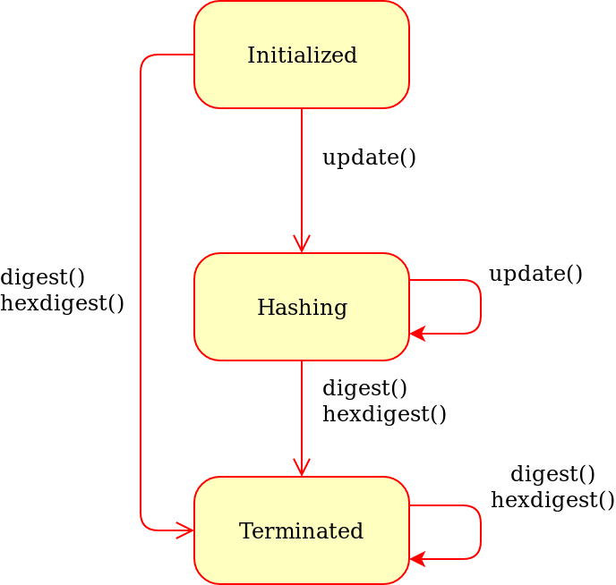

:mod:`Crypto.Hash` package
==========================

Cryptographic hash functions take arbitrary binary strings as input,
and produce a random-like fixed-length output (called *digest* or *hash value*).

It is practically infeasible to derive the original input data
from the digest. In other words, the cryptographic hash function is *one-way*
(*pre-image resistance*).

Given the digest of one message, it is also practically infeasible
to find another message (*second pre-image*) with the same digest
(*weak collision resistance*).

Finally, it is infeasible to find two arbitrary messages with the
same digest (*strong collision resistance*).

Regardless of the hash algorithm, an *n* bits long digest is at most
as secure as a symmetric encryption algorithm keyed with  *n/2* bits
(`birthday attack <https://en.wikipedia.org/wiki/Birthday_attack>`_).

Hash functions can be simply used as integrity checks. In
combination with a public-key algorithm, you can implement a
digital signature.

API principles
--------------

    Generic state diagram for a hash object

Every time you want to hash a message, you have to create a new hash object
with the :func:`new` function in the relevant algorithm module (e.g.
:func:`Crypto.Hash.SHA256.new`).

A first piece of message to hash can be passed to :func:`new` with the :attr:`data` parameter::

    >> from Crypto.Hash import SHA256
    >>
    >> hash_object = SHA256.new(data=b'First')

.. note::
    You can only hash *byte strings* or *byte arrays* (no Python 2 Unicode strings
    or Python 3 strings).

Afterwards, the method :meth:`update` can be invoked any number of times
as necessary, with other pieces of message::

    >>> hash_object.update(b'Second')
    >>> hash_object.update(b'Third')

The two steps above are equivalent to::

    >>> hash_object.update(b'SecondThird')

A the end, the digest can be retrieved with the methods :meth:`digest` or
:meth:`hexdigest`::

    >>> print(hash_object.digest())
    b'}\x96\xfd@\xb2$?O\xca\xc1a\x10\x15\x8c\x94\xe4\xb4\x085"\xd5"\xa8\xa4C\x9e+\x00\x859\xc7A'
    >>> print(hash_object.hexdigest())
    7d96fd40b2243f4fcac16110158c94e4b4083522d522a8a4439e2b008539c741

Attributes of hash objects
--------------------------

Every hash object has the following attributes:

.. csv-table:: 
    :header: Attribute, Description
    :widths: 20, 80

    digest_size, "Size of the digest in bytes, that is, the output
    of the :meth:`digest` method.
    It does not exist for hash functions with variable digest output
    (such as :mod:`Crypto.Hash.SHAKE128`).
    This is also a module attribute."
    block_size, "The size of the message block in bytes, input to the compression
    function. Only applicable for algorithms based on the Merkle-Damgard
    construction (e.g. :mod:`Crypto.Hash.SHA256`).
    This is also a module attribute."
    oid, "A string with the dotted representation of the ASN.1 OID
    assigned to the hash algorithm."

Modern hash algorithms
----------------------

- SHA-2 family

    - :doc:`sha224`
    - :doc:`sha256`
    - :doc:`sha384`
    - :doc:`sha512`

- SHA-3 family

    - :doc:`sha3_224`
    - :doc:`sha3_256`
    - :doc:`sha3_384`
    - :doc:`sha3_512`

- BLAKE2

    - :doc:`blake2s`
    - :doc:`blake2b`

Extensible-Output Functions (XOF)
---------------------------------

- SHAKE (in the SHA-3 family)

    - :doc:`shake128`
    - :doc:`shake256`

Message Authentication Code (MAC) algorithms
--------------------------------------------

- :doc:`hmac`
- :doc:`cmac`
- :doc:`poly1305`

Historich hash algorithms
-------------------------

The following algorithms should not be used in new designs:

- :doc:`sha1`
- :doc:`md2`
- :doc:`md5`
- :doc:`ripemd160`
- :doc:`keccak`
