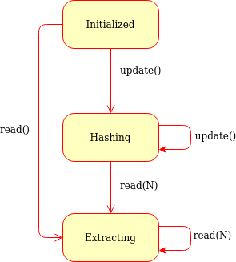

TurboSHAKE128 and TurboSHAKE256
===============================

TurboSHAKE is a family of *eXtendable-Output Functions* (XOFs) based on the Keccak permutation,
which is also the basis for SHA-3.

A XOF is a generalization of a cryptographic hash.
The output digest of a XOF can take any length, as required by the caller,
unlike SHA-256 (for instance) that always produces exactly 32 bytes.
The output bits of a XOF do **not** depend on the output length,
which means that the output length
does not even need to be known (or declared) when the XOF is created.

Therefore, a XOF object has a ``read(N: int)`` method (much like a file object)
instead of a ``digest()`` method. ``read()`` can be called any number of times,
and it will return different bytes each time.

    Generic state diagram for a XOF object

The TurboSHAKE family is not standardized. However, an RFC_ is being written.
It comprises of two members:

.. csv-table::
   :header: Name, (2nd) Pre-image strength, Collision strength

   TurboSHAKE128, "128 bits (output >= 16 bytes)", "256 bits (output >= 32 bytes)"
   TurboSHAKE256, "256 bits (output >= 32 bytes)", "512 bits (output >= 64 bytes)"

In addition to hashing, TurboSHAKE allows for domain separation
via a *domain separation byte* (that is, the ``domain`` parameter to :func:`Crypto.Hash.TurboSHAKE128.new`
and to :func:`Crypto.Hash.TurboSHAKE256.new`).

.. hint::

  For instance, if you are using TurboSHAKE in two applications,
  by picking different domain separation bytes you can ensure
  that they will never end up using the same digest in practice.
  The important factor is that the strings are different;
  the actual value of the domain separation byte is irrelevant.

In the following example, we extract 26 bytes (208 bits) from the TurboSHAKE128 XOF::

    >>> from Crypto.Hash import TurboSHAKE128
    >>>
    >>> xof = TurboSHAKE128.new()
    >>> xof.update(b'Some data')
    >>> print(xof.read(26).hex())
    d9dfade4ff8be344749908073916d3abd185ef88f5401024f029

.. _RFC: https://datatracker.ietf.org/doc/draft-irtf-cfrg-kangarootwelve/

.. automodule:: Crypto.Hash.TurboSHAKE128
    :members:

.. automodule:: Crypto.Hash.TurboSHAKE256
    :members:
