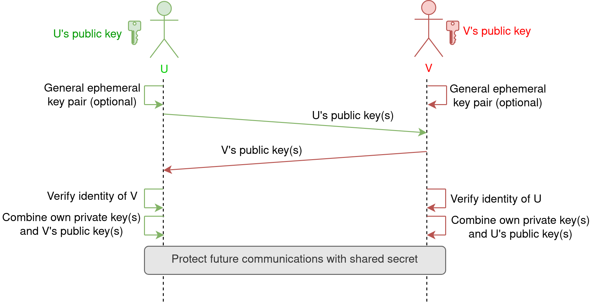

Diffie-Hellman Key Agreement
============================

Diffie-Hellman (DH) is a key agreement scheme based on asymmetric cryptography.

It enables two parties (below referred to as U and V) to jointly compute a shared secret
across an untrusted communication channel,
without explicitly transmitting the secret itself or parts of it.

In other words, an adversary can monitor the channel, see all exchanged messages,
and still learn nothing about the shared secret.

The shared secret is not used directly.
The two parties will derive symmetric keys from it,
and use those to encrypt and authenticate subsequent messages.

.. note::

  The Diffie-Hellman protocol is fairly generic and it can be implemented
  in many ways.

  This Python module implements Diffie-Hellman according to
  `Chapter 6 of NIST SP 800-56A Rev. 3 <https://nvlpubs.nist.gov/nistpubs/SpecialPublications/NIST.SP.800-56Ar3.pdf>`_,
  and only for elliptic curve cryptography (ECC CDH).

Examples
~~~~~~~~~

First, a minimal example where only static keys are used::

        from Crypto.PublicKey import ECC
        from Crypto.Hash import SHAKE128
        from Crypto.Protocol.DH import key_agreement

        # This KDF has been agreed in advance
        def kdf(x):
                return SHAKE128.new(x).read(32)

        # In a real scenario, this key already exists
        U = ECC.generate(curve='p256')

        # In a real scenario, this key is received from the peer
        # and it is verified as authentic
        V = ECC.generate(curve='p256').public_key()

        session_key = key_agreement(static_priv=U, static_pub=V, kdf=kdf)

        # session_key is an AES-256 key, which will be used to encrypt
        # subsequent communications

NIST SP 800-56A recommends to bind the key agreement to some information
concerning the context of the operation, for instance a description of what the keys are used for::

        from Crypto.Hash import TupleHash128
        from Crypto.Protocol.DH import key_agreement
        from functools import partial

        # Random value (e.g., a nonce)
        session_salt = b'XYZ'

        # The unique identifier of each party
        id_u = 'Client 12'
        id_v = 'Server 25'

        def kdf(x):
            h = TupleHash128.new(digest_bytes=32)
            h.update(x,
                     session_salt,
                     id_u.encode(),     # To UTF-8
                     id_v.encode(),     # To UTF-8
                     b'Email encryption',
                     b'TupleHash128',
                     b'AES256')
            return h.digest()

        # In a real scenario, this key already exists
        U = ECC.generate(curve='p256')

        # In a real scenario, this key is received from the peer
        # and it is verified as authentic
        V = ECC.generate(curve='p256').public_key()

        key = key_agreement(static_priv=U, static_pub=V, kdf=kdf)

The examples above all used static keys only.
In order to achieve *Perfect Forward Secrecy*,
it is recommended that at least one party (but ideally both)
contributes to the key agreement with one ephemeral key
(that is, one key pair generated for the session, and destroyed at the end)::

        from Crypto.PublicKey import ECC
        from Crypto.Hash import SHAKE128
        from Crypto.Protocol.DH import key_agreement

        # This KDF has been agreed in advance
        def kdf(x):
                return SHAKE128.new(x).read(32)

        # In a real scenario, this long-term key already exists
        U_static = ECC.generate(curve='p256')

        # This ephemeral key is generated only for this session
        U_ephemeral = ECC.generate(curve='p256')

        # In a real scenario, this long-term key is received from the peer
        # and it is verified as authentic
        V_static = ECC.generate(curve='p256').public_key()

        # In a real scenario, the peer generated this ephemeral key only
        # for this session. It doesn't need to be authenticated if the
        # static key of V already has been.
        V_ephemeral = ECC.generate(curve='p256').public_key()

        session_key = key_agreement(static_priv=U_static,
                                    static_pub=V_static,
                                    eph_priv=U_priv,
                                    eph_pub=U_pub,
                                    kdf=kdf)

        # session_key is an AES-256 key, which will be used to encrypt
        # subsequent communications

Specification
~~~~~~~~~~~~~

.. autofunction:: Crypto.Protocol.DH.key_agreement

Key Derivation Function
~~~~~~~~~~~~~~~~~~~~~~~~

The ``kdf`` parameter must be a cryptographically secure key derivation function,
not password-based. For instance, some reasonable choices are:

* :ref:`hkdf`
* :ref:`shake128` or :ref:`shake256`
* :ref:`sp800-180-counter`

KDFs are typically fed with multiple inputs,
whereas the ``kdf`` function must take exactly one (of type ``bytes``).
Therefore, a temporary function ``kdf`` should be constructed
by fixing some of the inputs of the underlying KDF.
For example using ``functools``::

        from Crypto.Protocol.KDF import HDKF
        from Crypto.Hash import SHA256
        import functools

        kdf = functoools.partial(HDK,
                                 key_len=32,
                                 salt=b'nonce',
                                 hashmod=SHA256,
                                 num_keys=2,
                                 context=b'Some context about the operation')

        # Pass kdf to key_agreement()

In other cases, defining a local function can be sufficient::

        import os
        from Crypto.Hash import SHAKE128

        # A non-secret value generated for the session
        nonce = os.urandom(16)

        def kdf(x):
                return SHAKE128.new(x + nonce).read(32)

        # Pass kdf to key_agreement()

Recommendations
~~~~~~~~~~~~~~~~~~~~~~~

This module only provides the fundamental low-level primitive of the Diffie-Hellman key agreement.
When designing the procotol, users should ensure that:

- Each party is certain that the public key of the peer is authentic,
  and that the risk of Man-in-the-Middle attacks is considered.

- The requirement for *Perfect Forward Secrecy* is understood and, if necessary,
  ephemeral keys are generated, used in the key agreement, and then destroyed.

- The risk of *Key compromise impersonation* is understood.
  With that attack, an adversary that compromises our static key,
  can impersonate *any other user to us*.
  The use of ephemeral keys addresses this risk too.

- Some form of *Key Confirmation* is included after the key agreement (e.g., with a MAC),
  to immediately detect
  if the shared secret has not being correctly calculated.

.. _NIST: https://nvlpubs.nist.gov/nistpubs/SpecialPublications/NIST.SP.800-56Ar3.pdf

