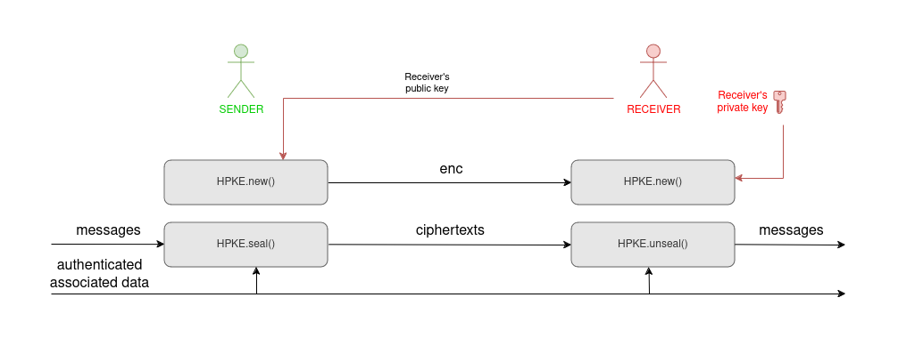
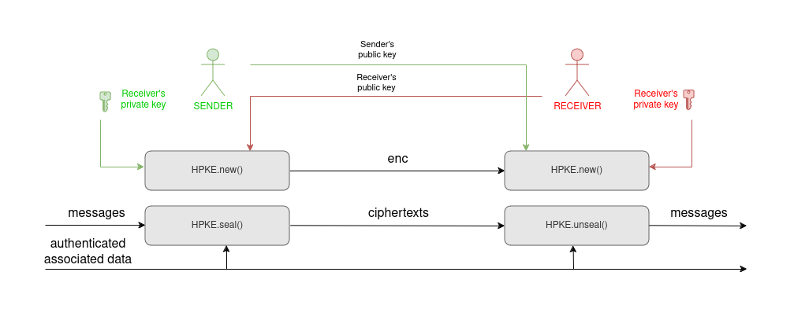
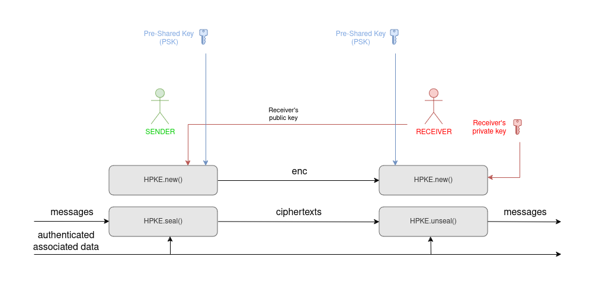

Hybrid Public Key Encryption (HPKE)
=====================================

HPKE (`RFC 9180 <https://www.rfc-editor.org/rfc/rfc9180.html>`_)
is a cryptographic protocol that enables secure communication
using a combination of public key (ECC Diffie-Hellman)
and symmetric encryption (AEAD) techniques.

It allows a sender that knows the public key of the intended recipient,
to encrypt one or more messages
ensuring confidentiality and integrity but without requiring
an online key exchange.

There are no significant limits on the size of one message or
on the number of messages in the sequence.
Along with each encrypted message (**ciphertext**),
the sender can also deliver a piece of non-sensitive data (e.g., a header),
which will be authenticated together with the matching message
(**authenticated associated data, AAD**).

Before, or together with the first message, the sender must deliver
the encapsulated session secret (**enc**) to the receiver.

In the basic scheme above, the receiver does not receive any proof
of identity from the sender.
Variants of the protocol exist to enable the receiver to ascertain
the origin of the message.

First (*Auth* mode), the sender can contribute its own private key to the encryption.
The receiver must have the matching public key:

Second (*PSK* mode), the sender and the receiver can both agree on the same
secret key (at least 32 random bytes), and contribute that to the encryption.

Finally, the two authentication modes can also be combined together (*AuthPSK* mode).

Examples
~~~~~~~~~

This is how the sender can encrypt two messages::

        from Crypto.Protocol import HPKE

        # Let's assume that the recipient delivered its public key
        # which is already loaded in a variable called destination_key

        encryptor = HPKE.new(receiver_key=destination_key,
                             aead_id=HPKE.AEAD.AES128_GCM)

        ct_1 = encryptor.seal(b'Message 1')
        ct_2 = encryptor.seal(b'Message 1')

        # The sender will deliver:
        # - encryptor.enc
        # - ct_1
        # - ct_2

And this is how the receive can decrypt them::

        from Crypto.Protocol import HPKE

        # Let's assume that the recipient has its own private key
        # which is already loaded in a variable called my_key

        decryptor = HPKE.new(receiver_key=my_key,
                             aead_id=HPKE.AEAD.AES128_GCM,
                             enc=encryptor.enc)

        # Any of the calls to unseal() can raise ValueError
        # if a key mismatch, modified messages, or reordering is detected
        pt1 = decryptor.unseal(ct_1)
        pt2 = decryptor.unseal(ct_2)

Specification
~~~~~~~~~~~~~

.. autoclass:: Crypto.Protocol.HPKE.AEAD
   :members:
   :undoc-members:

.. autofunction:: Crypto.Protocol.HPKE.new

.. autoclass:: Crypto.Protocol.HPKE.HPKE_Cipher
   :members:
   :undoc-members:
