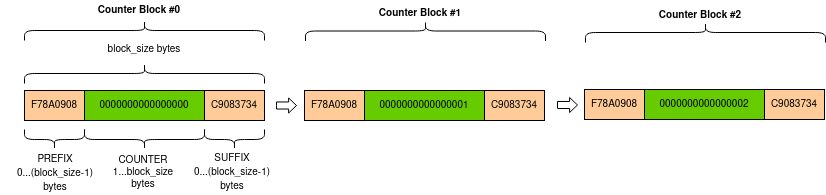
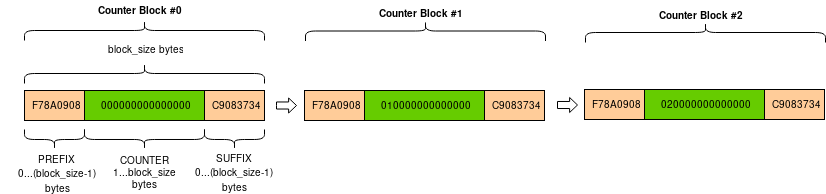

:mod:`Crypto.Util` package
==========================

Useful modules that don't belong in any other package.

.. toctree::
    :hidden:
    
    asn1

:mod:`Crypto.Util.Padding` module
---------------------------------

This module provides minimal support for adding and removing standard padding
from data.

.. automodule:: Crypto.Util.Padding
    :members:

:mod:`Crypto.Util.RFC1751` module
---------------------------------

.. automodule:: Crypto.Util.RFC1751
    :members:

:mod:`Crypto.Util.strxor` module
--------------------------------

Fast XOR for byte strings.

.. automodule:: Crypto.Util.strxor
    :members:

:mod:`Crypto.Util.Counter` module
---------------------------------

Richer counter functions for CTR cipher mode.

:ref:`CTR <ctr_mode>` is a mode of operation for block ciphers.

The plaintext is broken up in blocks and each block is XOR-ed with a *keystream* to
obtain the ciphertext.
The *keystream* is produced by the encryption of a sequence of *counter blocks*, which
all need to be different to avoid repetitions in the keystream. Counter blocks
don't need to be secret.

The most straightforward approach is to include a counter field, and increment
it by one within each subsequent counter block.

The :func:`new` function at the module level under ``Crypto.Cipher`` instantiates
a new CTR cipher object for the relevant base algorithm.
Its parameters allow you define a counter block with a fixed structure:

* an optional, fixed prefix
* the counter field encoded in big endian mode

The length of the two components can vary, but together they must be as large
as the block size (e.g. 16 bytes for AES).

Alternatively, the ``counter`` parameter can be used to pass a counter block
object (created in advance with the function :func:`Crypto.Util.Counter.new()`)
for a more complex composition:

* an optional, fixed prefix
* the counter field, encoded in big endian or little endian mode
* an optional, fixed suffix

As before, the total length must match the block size.

The counter blocks with a big endian counter will look like this:

The counter blocks with a little endian counter will look like this:

Example of AES-CTR encryption with custom counter::

    from Crypto.Cipher import AES
    from Crypto.Util import Counter
    from Crypto import Random
    
    nonce = Random.get_random_bytes(4)
    ctr = Counter.new(64, prefix=nonce, suffix=b'ABCD', little_endian=True, initial_value=10)
    key = b'AES-128 symm key'
    plaintext = b'X'*1000000
    cipher = AES.new(key, AES.MODE_CTR, counter=ctr)
    ciphertext = cipher.encrypt(plaintext)

.. automodule:: Crypto.Util.Counter
    :members:

:mod:`Crypto.Util.number` module
--------------------------------

.. automodule:: Crypto.Util.number
    :members:
